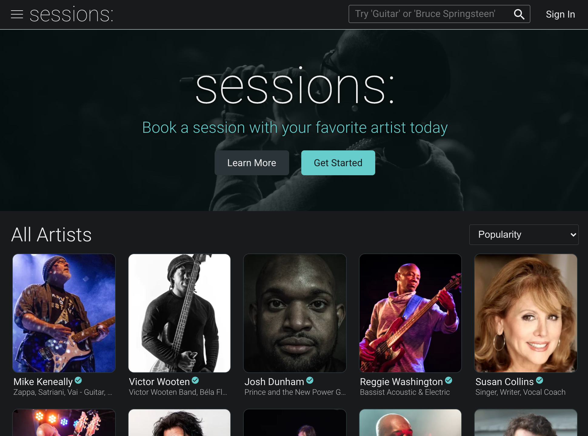
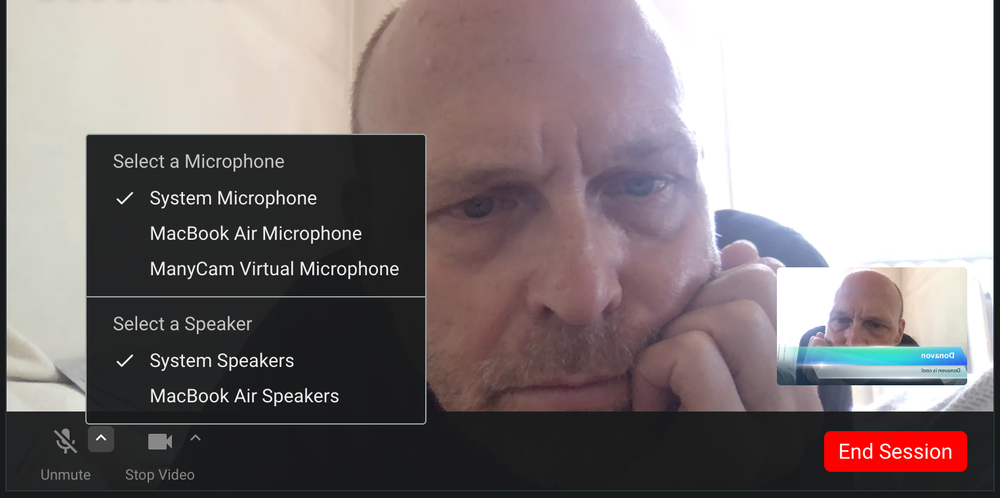

# Sessions FM sample website



This document will serve as a sample as to how the Sessions FM app (i.e. the website) is layed out.

## Code

The code is a React application running on Netlify with serverless functions (i.e. lambda). The source is in `/src/client` with the lambda source in `/src/lambda`.

All code is written in TypeScript.

Here is a high-level overview.


### Client (i.e. front-end)

The client uses Marauder for dynamic data and code loading of a React "data component". Marauder caches data loads so that page re-visits are super fast.

### Sample code

Here is a typical Sessions React component.

In this example, wew are display a deck of cards, where a `Card` describes an artist record. This is what is shown on the initial Sessions FM screen.

```tsx
import React from 'react';

import { Cards } from '../../components/Cards';
import { Markdown } from '../../components/Markdown';
import { DeckExpanded } from '../../../common/types/Deck';
import styles from './style.module.scss';

type DeckProps = {
  deck: DeckExpanded;
};

export const Deck: React.FC<DeckProps> = ({ deck }) => {
  const { cards, title, description } = deck;

  return (
    <div className={styles.deck}>
      <div className={styles.heading}>
        <h2>{title}</h2>
        <Markdown markdown={description} />
      </div>
      <Cards artists={cards} />
    </div>
  );
};
```

As you can see, we use CSS Modules for styling.

Although not shown here, we also use custom React Hooks where applicable.

The app uses AWS Chime for Zoom-like in-browser peer-to-peer video conferencing. We intend to open source our React wrapper around the chime JavaScript API.



### Lambda (i.e. back-end)

Most of the Lambda code runs as Netlify functions. It's compiled down and packaged into JavaScript from TypeScript.

We use MongoDB as a service (i.e. Atlas) for data storage. Mongo is a NoSQL database.

Parts of the back-end impliment AWS SQS and use AWS Lambda functions directly.

### Example back-end code

Here is the back-end code that fetches a single record from MongoDB.

```ts
import { FilterQuery } from 'mongodb';

import { getCollection } from './utils/getCollection';

type FetchDocumentProps<T> = {
  collectionName: string;
  filter: FilterQuery<T>;
};

export const fetchDocument = async <T = any>({
  collectionName,
  filter,
}: FetchDocumentProps<T>): Promise<T> => {
  const collection = await getCollection<T>(collectionName);
  return collection.findOne<T>(filter);
};
```

## Style Guide

This is a serve as a quick style guide to how we code at Sessions FM. We do this to ensure a consistant coding style throughout the application.

### Variables

Use `const` where possible. If you use a `let`, be prepared to defend it in the PR.

Use informative variable names. Boolean variables should start with "is", "has", etc.

### Function components

We use React "function components" with custom hooks. Class components, HOCs, and render props are dead to us.

### Semi-colons please

You knew we'd get there eventually. Use semi-colons and 2 spaces for tabs. But don't fret — we use Prettier for effortless formatting.

### Named exports

We strive to use named function exports where practical. i.e. No `export default Foo`.

## Interested in joining the team?

We're always looking for good coders to help out. If you're interested, contact [Ross Freeman](mailto:ross@sessions.fm) to find out more.

### Code Challange

You will be asked to take the following coding challenge. It's a basic ~~Hangman~~ HangPERSON app using **TypeScript** and **React**.

You can [take the coding challenge](https://codesandbox.io/s/hangman-860wk) which is hosted on CodeSandbox (an online IDE).

We know these things are awful and that you have better things to do with your time than to code for free, so we've designed the challenge to take no more than an hour or two. But take as much or as little time as you'd like. Most importantly, have fun!

<p>

</p>
